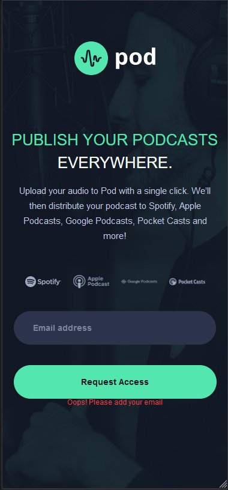
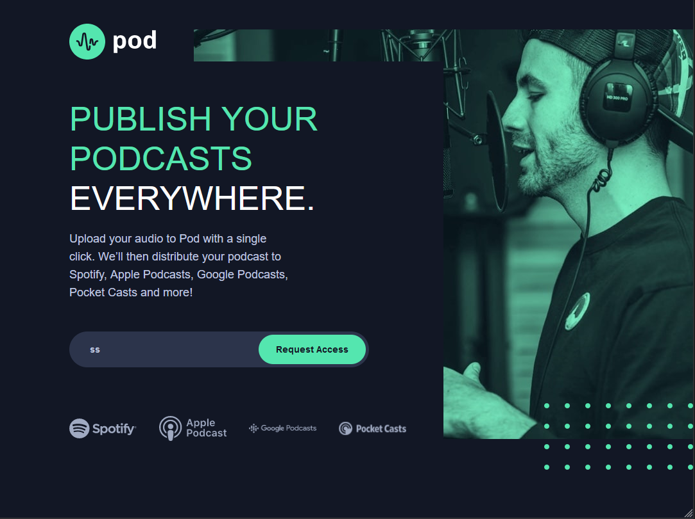
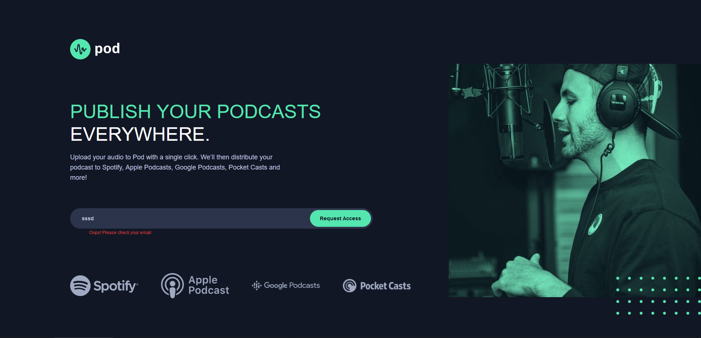

# Frontend Mentor - Pod request access landing page solution

This is a solution to the [Pod request access landing page challenge on Frontend Mentor](https://www.frontendmentor.io/challenges/pod-request-access-landing-page-eyTmdkLSG). Frontend Mentor challenges help you improve your coding skills by building realistic projects. 

## Table of contents

- [Overview](#overview)
  - [The challenge](#the-challenge)
  - [Screenshot](#screenshot)
  - [Links](#links)
- [My process](#my-process)
  - [Built with](#built-with)
  - [What I learned](#what-i-learned)
  - [Continued development](#continued-development)
  - [Useful resources](#useful-resources)
- [Author](#author)

## Overview

### The challenge

Users should be able to:

- View the optimal layout depending on their device's screen size
- See hover states for interactive elements
- Receive an error message when the form is submitted if:
  - The `Email address` field is empty should show "Oops! Please add your email"
  - The email is not formatted correctly should show "Oops! Please check your email"

### Screenshot

mobile:

iPad:

PC:

### Links

- Solution URL: https://github.com/BartoszPie/POD
- Live Site URL: https://bartoszpie.github.io/POD/

## My process

### Built with

- Semantic HTML5 markup
- CSS custom properties
- Flexbox
- Mobile-first workflow
- JS

### What I learned

I wanted to create different page for mobile and for pc's so I used display: none for everything and created new content in html.
I am sure there are better ways to do it but I am still proud about my idea :D

That was my second project with JS, so although it was easy still I feel satisfied after iv done this site :D 

### Continued development

I will focus on doing a lot of JS right now until I will be good at basics, then ill get to react 

### Useful resources

I used a lot of Wes-Bos tutorials.

## Author

- Github - [Bartosz Pietrus](https://github.com/BartoszPie)
- Frontend Mentor - [@yBartoszPie](https://www.frontendmentor.io/profile/BartoszPie)
